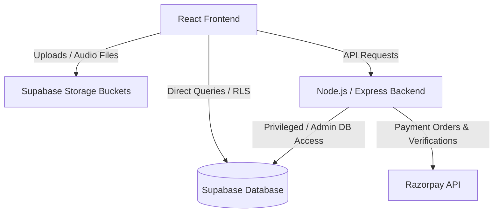

# Tuneraaga Web Application: Services, Modules, and Responsibilities

This document provides a comprehensive overview of the architecture, services, modules, and their individual responsibilities in the **Tuneraaga-Web** codebase.

---

## 1. High-Level Architecture

Tuneraaga is a music and podcast streaming application built using a modern decoupled architecture:

*   **Frontend**: React (Vite-based SPA) communicating directly with Supabase for data access (where security policies allow) and calling a custom Express backend for privileged operations (payments, PDF receipts, admin control, auth-user creation).
*   **Backend**: Node.js/Express API gateway that orchestrates billing (Razorpay), secure Supabase actions (using the Service Role admin key), and mail/receipt operations.
*   **Database & Storage**: Supabase (PostgreSQL database + Blob Storage buckets) for file assets, user data, and audio releases.

---

## 2. Backend Modules & Responsibilities

The backend server is situated in the `backend/` directory.

### Core Entry Point
*   **[server.js](file:///c:/Users/Admin/Documents/GitHub/Tuneraaga-Web/backend/server.js)**: Configures the Express server environment, handles CORS settings, registers global JSON body parsers (with 50MB payload limits for file transfers), mounts module-specific routers, and exposes a root health check (`/`).

### Configuration Layer (`backend/config/`)
*   **[supabaseClient.js](file:///c:/Users/Admin/Documents/GitHub/Tuneraaga-Web/backend/config/supabaseClient.js)**:
    *   Exposes `supabase` (anonymous public client).
    *   Exposes `supabaseAdmin` (service role database client) used to bypass Row-Level Security (RLS) for administrator actions like managing `auth.users` accounts and user record synchronization.
    *   Defines the default storage bucket name (`TuneRaaga`).
*   **[razorpay.js](file:///c:/Users/Admin/Documents/GitHub/Tuneraaga-Web/backend/config/razorpay.js)**: Initializes and exports the instance of the Razorpay SDK using the server-side environment variables `RAZORPAY_KEY_ID` and `RAZORPAY_KEY_SECRET`.

### Middlewares (`backend/middleware/`)
*   **[authMiddleware.js](file:///c:/Users/Admin/Documents/GitHub/Tuneraaga-Web/backend/middleware/authMiddleware.js)**:
    *   `authenticateUser`: Validates the `Authorization: Bearer <token>` header against Supabase auth. Sets `req.user` if valid; otherwise, returns `401 Unauthorized`.
    *   `optionalAuth`: Attempts to authenticate the user but fails gracefully (proceeds without adding `req.user`) if no token is found.
*   **[uploadMiddleware.js](file:///c:/Users/Admin/Documents/GitHub/Tuneraaga-Web/backend/middleware/uploadMiddleware.js)**: Configures Multer to store uploaded files in memory (`memoryStorage`) with a size limit of 50MB before uploading to Supabase Storage.
*   **[validateOrderPayload.js](file:///c:/Users/Admin/Documents/GitHub/Tuneraaga-Web/backend/middleware/validateOrderPayload.js)**: Validates incoming request bodies for order placement. Checks if `email`, `userId`, `plan` (UUID), and `amount` (numeric, positive) are valid formats before invoking controllers.

### Utilities (`backend/utils/`)
*   **[generateReceiptPDF.js](file:///c:/Users/Admin/Documents/GitHub/Tuneraaga-Web/backend/utils/generateReceiptPDF.js)**:
    *   Generates custom printable invoice/receipt PDFs dynamically.
    *   Applies layout styles, item tables, tax info, total amounts, and outputs a buffer stream that can be returned as a file download.

### Routing & Controllers

#### A. Authentication & User Administration Module
*   **Route Mapping**: `/api/auth` $\rightarrow$ **[authRoutes.js](file:///c:/Users/Admin/Documents/GitHub/Tuneraaga-Web/backend/routes/authRoutes.js)**
*   **Controller**: **[authController.js](file:///c:/Users/Admin/Documents/GitHub/Tuneraaga-Web/backend/controllers/authController.js)**
*   **Responsibilities**:
    1.  `login`: Signs in users securely through Supabase Auth, retrieves credentials, checks permissions in the `public.users` table, and returns session tokens.
    2.  `signup`: Creates new accounts using Supabase auth and populates a new profile entry in the database `users` table with a default `user` role.
    3.  `getProfile`: Resolves the active user profile from the database matching the verified authentication token.
    4.  `logout`: Sign-out logic.
    5.  `getAllUsers` / `getUserStats` *(Admin only)*: Fetches user rosters and sign-up metrics for the administration dashboard.
    6.  `updateUserRole` *(Admin only)*: Updates a user's role (e.g., converting a normal user to `admin` or `artist`).
    7.  `deleteUser` *(Admin only)*: Removes a user profile and deletes their corresponding account inside Supabase's identity register, alongside purging their user-specific metadata (history, likes).

#### B. Artist Management Module
*   **Route Mapping**: `/api/artists` $\rightarrow$ **[artistRoutes.js](file:///c:/Users/Admin/Documents/GitHub/Tuneraaga-Web/backend/routes/artistRoutes.js)**
*   **Controller**: **[artistController.js](file:///c:/Users/Admin/Documents/GitHub/Tuneraaga-Web/backend/controllers/artistController.js)**
*   **Responsibilities**:
    1.  `getAllArtists` *(Public)*: Fetches all listed artists.
    2.  `createArtist` *(Public/Admin)*: Handles the onboarding registration flow of a new artist. It inserts authentication credentials, uploads profile avatars to the Supabase Storage bucket, and registers details into the `artists` database table.
    3.  `updateArtist` *(Admin/Artist)*: Modifies details (biography, genres, active status, social links, profile pictures).
    4.  `deleteArtist` *(Admin)*: Removes an artist's database record and deletes the corresponding Supabase Auth user.

#### C. Order, Subscriptions & Billing Module
*   **Route Mapping**: `/api` $\rightarrow$ **[orderRoutes.js](file:///c:/Users/Admin/Documents/GitHub/Tuneraaga-Web/backend/routes/orderRoutes.js)**
*   **Controller**: **[orderController.js](file:///c:/Users/Admin/Documents/GitHub/Tuneraaga-Web/backend/controllers/orderController.js)**
*   **Responsibilities**:
    1.  `createOrderSummaryPay`: Creates a billing order record in the local database marked with a status of `pending`.
    2.  `createRazorpayOrder`: Communicates with Razorpay's API to construct a official transaction order block, linking it back to the database.
    3.  `verifyPayment`: Processes payment callbacks. Cryptographically verifies Razorpay payload signatures, updates order statuses to `paid`, provisions new active Pro plans, updates subscription metadata, and emails invoice confirmations.
    4.  `checkOrderStatus`: Reports whether a specific transaction is finalized.
    5.  `downloadReceipt`: Retrieves details of a completed purchase and uses the PDF utility to return a dynamic printable invoice.

---

## 3. Frontend Modules & Responsibilities

The frontend codebase is in the `frontend/` directory.

### Core Architecture & State
*   **[main.jsx](file:///c:/Users/Admin/Documents/GitHub/Tuneraaga-Web/frontend/src/main.jsx)**: Application mounting configuration.
*   **[App.jsx](file:///c:/Users/Admin/Documents/GitHub/Tuneraaga-Web/frontend/src/App.jsx)**: Orchestrates the client routing map (React Router), layout grouping, and applies page-level access protections.
*   **[PlayerContext.jsx](file:///c:/Users/Admin/Documents/GitHub/Tuneraaga-Web/frontend/src/components/PlayerContext.jsx)** & **[PlayerProvider.jsx](file:///c:/Users/Admin/Documents/GitHub/Tuneraaga-Web/frontend/src/components/PlayerProvider.jsx)**:
    *   Maintains the global audio player state (playing, paused, volume, active track details, queue, progress tracker).
    *   Supplies the audio pipeline context down the React tree.
*   **[ProtectedRoute.jsx](file:///c:/Users/Admin/Documents/GitHub/Tuneraaga-Web/frontend/src/components/ProtectedRoute.jsx)**: Guard component restricting specific pages (like `/admin` or `/artist`) to users with authorized credentials.

### Pages & Layouts (`frontend/src/pages/`)
The pages are grouped into three primary logical flows:

#### 1. Public Streaming & Core Experience
*   **`Dashboard.jsx`**: Main client home view showcasing recommended releases, recent tracks, and top playlists.
*   **`NewRelease.jsx`**: Visual directory of new albums, singles, and podcasts.
*   **`ArtistProfile.jsx` / `AlbumDetail.jsx`**: Deep-dive details pages for specific media.
*   **`Podcast.jsx`**: Podcast hub with category filter lists and episodic queues.
*   **`Radio.jsx`**: Live stream player component handling radio streams.
*   **`LikedSongs.jsx` / `History.jsx`**: Personalized user libraries.
*   **`ProPlans.jsx` / `PackageSummary.jsx` / `PaymentReceipt.jsx`**: Marketing, onboarding, billing checkout screens, and transaction summary displays for premium memberships.

#### 2. Artist Space (`frontend/src/artist/`)
*   **`ArtistLayout.jsx`**: Custom layout containing specific side navigation menus for registered creators.
*   **`ArtistDashboard.jsx`**: Overview screen highlighting release metrics, track performance, audience reach, and analytics.
*   **`ArtistSettings.jsx`**: Self-service profile updates for creators.

#### 3. Administrative Center (`frontend/src/admin/`)
*   **`AdminLayout.jsx`**: Portal shell and sidebar navigation tailored for platform admins.
*   **`AdminDash.jsx`**: Core admin metrics dashboard reporting analytics, sign-up records, and system shortcuts.
*   **`ArtistManager.jsx`**: Admin dashboard to review, verify, approve, edit, or reject artist profiles.
*   **`AdminNewRelease.jsx` / `SongManager.jsx` / `SongEditAdmin.jsx`**: Central content control panel to create releases, upload music assets (audio/image files), catalog metadata, and delete assets from storage buckets.
*   **`PodcastAdmin.jsx`**: Admin manager for creating podcasts, cataloging episodes, and managing podcast artwork.
*   **`RadioAdmin.jsx`**: Interface to register live streaming feeds, radio categories, and schedules.
*   **`TopChartAdmin.jsx` / `TopPlaylistAdmin.jsx` / `TrendingSongsAdmin.jsx`**: Curates featured platform placements.

### Hooks & Utilities (`frontend/src/hooks/` & `frontend/src/lib/` & `frontend/src/utils/`)
*   **[useAudioPlayer.js](file:///c:/Users/Admin/Documents/GitHub/Tuneraaga-Web/frontend/src/hooks/useAudioPlayer.js)**: Custom React hook encapsulation that hooks directly into HTMLAudioElement lifecycles.
*   **[supabaseClient.js](file:///c:/Users/Admin/Documents/GitHub/Tuneraaga-Web/frontend/src/lib/supabaseClient.js)**: Client-side connector initialization for Supabase queries. Exposes helper classes for fetching tokens from local sessions and wraps raw fetch operations inside a standardized `apiCall` helper for server communication.
*   **[razorpayPayment.js](file:///c:/Users/Admin/Documents/GitHub/Tuneraaga-Web/frontend/src/utils/razorpayPayment.js)**: Coordinates client side Razorpay Checkout integrations, managing standard gateway dialog windows and signature callback validation payloads.
*   **[subgener.js](file:///c:/Users/Admin/Documents/GitHub/Tuneraaga-Web/frontend/src/lib/subgener.js)**: Static lookup mapping for music sub-genres.

---

## 4. Key Database Table Mappings

| Table Name | Scope / Module | Primary Fields & Purpose |
| :--- | :--- | :--- |
| `users` | Auth | `id`, `email`, `role` (user/admin/artist). Links to Supabase authentication identity. |
| `artists` | Creators | `id`, `name`, `genre`, `bio`, `email`, `verified`, `status` (Pending/Approved), social links, image URLs. |
| `releases` | Media Content | Main song metadata containing tracks, storage audio paths, titles, release dates, durations. |
| `podcasts` | Media Content | Podcast show descriptions, authors, artwork paths. |
| `podcast_episodes` | Media Content | Episode-level descriptors, runtimes, audio file paths, link to parental podcast entry. |
| `radio_stations` | Media Content | Live audio streams, tags, language groupings, status indicators. |
| `pro_plans` | Billing | `id`, `name`, `is_active`. Defines available membership structures. |
| `pro_plan_prices` | Billing | `id`, `plan_id`, `price`, `duration_label` (e.g. Month/Year). Price tables. |
| `orders` | Billing | `id`, `user_id`, `plan_id`, `amount`, `status` (pending/paid), transaction IDs. |
| `likes` | Personalized | User favorites links connecting user IDs to audio release IDs. |
| `history` | Personalized | User play history logging recent listen queues. |
